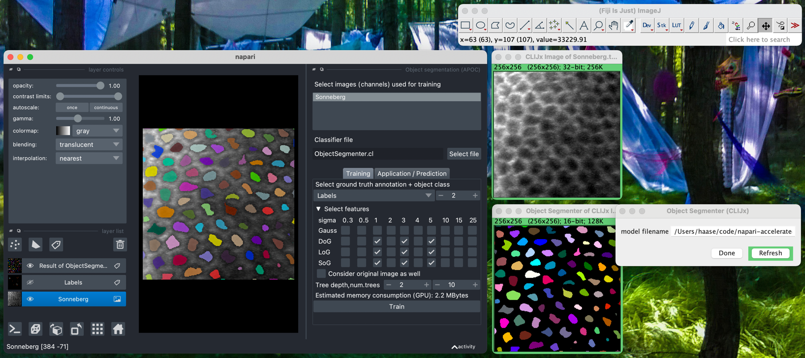

# CLIJx accelerated pixel and object classification (APOC)

This is an experimental Fiji plugin enabling GPU-accelerated pixel- and object classification in Fiji based on
[scikit-learn](https://scikit-learn.org/), 
[CLIJ2](https://clij.github.io) and
[APOC](https://github.com/haesleinhuepf/apoc).
It is the sibling of [napari-accelerated-pixel-and-object-classification](https://github.com/haesleinhuepf/napari-accelerated-pixel-and-object-classification).



## Installation instructions

* Download and install [Fiji](https://fiji.sc/Downloads). 
* Activate the update-sites "apoc", "clij" and "clij2" as explained [here](https://clij.github.io/clij2-docs/installationInFiji). 
* Optional: If you want to use the APOC classifiers from the [clijx-assistant](https://github.com/clij/clijx-assistant) graphical user interface, please activate the "clijx-assistant" update-site as well. Note: In case you want to install the clijx-assistant-extensions (which is not necessary), please read the [installation instructions](https://clij.github.io/assistant/installation#extensions).
* Restart Fiji.

## Usage: Classifier training

Training is only available in the [napari](https://napari.org/) plugin as we are using [scikit-learn](https://scikit-learn.org/) for training.
If you want to train classifiers with a graphical user interface, please read the documentation [here](https://github.com/haesleinhuepf/napari-accelerated-pixel-and-object-classification).
If you prefer training classifiers from python / jupyter notebooks, please refer to the documentation [here](https://github.com/haesleinhuepf/apoc).
The second option has the advantage that you can train pixel classifiers using multiple input images.

## Usage: Classifier application / prediction

Once models are trained, you can apply them to your data also from Fiji.
You find all necessary menu entries under `Plugins > ImageJ on GPU (CLIJx) > Segmentation > APOC`.
If you trained an object-segmenter that takes two images into account, you should for example click on the `Apply object segmenter on GPU (1 input image, CLIJx-APOC experimental)` menu entry.
Furthermore, if you installed the CLIJx-assistant, you will find the `ObjectSegmenter` also in the assistant's right-click menu in the category `Label`:


After the `ObjectSegmenter` was started, right-click it again and select `ObjectSegmenter (CLIJx, experimental)` to open its options dialog:


Enter the correct path to the classifier file in the text field and click on `Refresh`:


## Usage: Scripting

You can use the assistant's code generation capabilities, by right-clicking and selecting the menu `Generate Script > ImageJ Macro`:


It will then generate code that can serve as hint on how to execute the classifiers from ImageJ Macro for example.

```
// Object Segmenter
model_filename = "/path/to/file/ObjectSegmenter.cl";
Ext.CLIJx_objectSegmenter(input_image, result_label_image, model_filename);
```

For more hints for CLIJ2 macro scripting, please refer to the [documentation](https://clij.github.io/clij2-docs/md/basics/) and
read the built-in documentation in the auto-completion in the Fiji Script Editor:


## Contributing

Contributions are very welcome. Please refer to our [community guidelines](https://clij.github.io/clij2-docs/community_guidelines).

## License

Distributed under the terms of the [BSD-3](https://github.com/clij/clijx-accelerated-pixel-and-object-classification/blob/main/license.txt) license,
"clijx-accelerated-pixel-and-object-classification" is free and open source software

## Issues

If you encounter any problems, please [open a thread on image.sc](https://image.sc) along with a detailed description and tag [@haesleinhuepf](https://github.com/haesleinhuepf).

